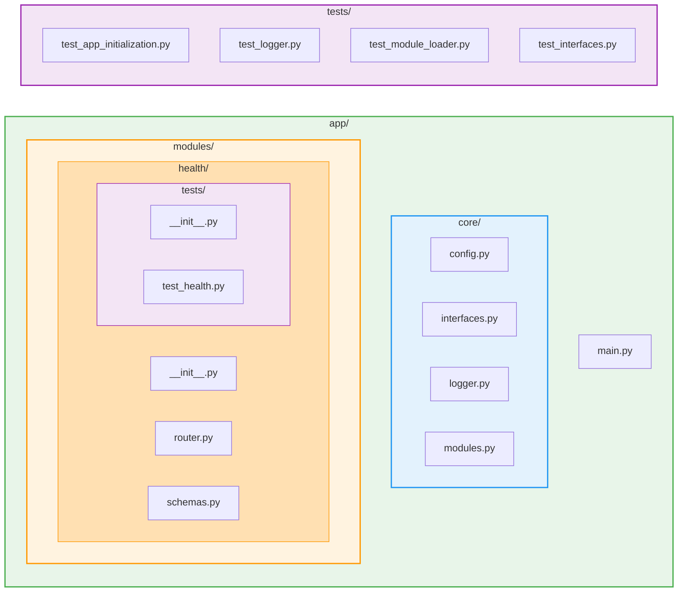

# Task Manager Backend

A clean, maintainable FastAPI backend following **strict SOLID principles** and clean architecture


## Project Structure



## Architecture Principles

### Modular Architecture (Django-Style)
- **Self-contained modules**: Each feature is a separate module
- **Easy to add/remove**: Just add to `INSTALLED_MODULES` list
- **Independent development**: Teams can work on different modules
- **Clear boundaries**: Each module owns its domain

### SOLID Principles (100% Compliance)

#### 1. Single Responsibility Principle (SRP)
- Each class/function has **one reason to change**
- `ModuleLoader` has focused methods: `import_module()`, `validate_module()`, `register_module()`
- `configure_cors()` only handles CORS configuration
- Separate concerns throughout the codebase

#### 2. Open/Closed Principle (OCP)
- **Open for extension**: Add new modules to `INSTALLED_MODULES`
- **Closed for modification**: No code changes needed to add features
- Module-based architecture allows seamless extension

#### 3. Liskov Substitution Principle (LSP)
- Formal **Protocol** definitions (`LoggerProtocol`, `ModuleProtocol`)
- All implementations are substitutable
- Type-safe with runtime validation

#### 4. Interface Segregation Principle (ISP)
- Minimal, focused interfaces
- `LoggerProtocol`: only 3 methods (info, warning, error)
- `ModuleProtocol`: only 1 attribute (router)
- No fat interfaces

#### 5. Dependency Inversion Principle (DIP)
- **Depend on abstractions**, not concrete implementations
- Full dependency injection in `create_app(config, logger)`
- Settings and logger are injected, not hardcoded
- Easy to test with mock dependencies

## Setup

### Install Dependencies

```bash
poetry install
```

### Run Development Server

```bash
poetry run uvicorn app.main:app --reload --host 127.0.0.1 --port 8000
```

### Run Tests

```bash
# Run all tests with coverage
poetry run pytest

# Run specific test file
poetry run pytest tests/test_hello_world_api.py -v

# View coverage report
poetry run pytest --cov-report=html
open htmlcov/index.html
```

## API Documentation

Once the server is running:

- **Swagger UI**: http://127.0.0.1:8000/docs
- **ReDoc**: http://127.0.0.1:8000/redoc

## Environment Configuration

Create a `.env` file in the backend directory:

```env
# Application Settings
APP_NAME="Task Manager API"
APP_DESCRIPTION="A task management API built with FastAPI"
APP_VERSION="0.1.0"
DEBUG=false

# CORS Configuration (NEW!)
CORS_ORIGINS=["http://localhost:3000", "https://myapp.com"]
CORS_ALLOW_CREDENTIALS=true
CORS_ALLOW_METHODS=["*"]
CORS_ALLOW_HEADERS=["*"]
```

**Why configurable CORS?**
- Production: Restrict to specific domains
- Development: Allow localhost
- No code changes needed - just update `.env`

## Adding New Modules

### 1. Create Module Directory

```bash
mkdir -p app/modules/users
```

### 2. Create Module Files

```python
# app/modules/users/__init__.py
"""Users feature module."""
from app.modules.users.router import router
__all__ = ["router"]

# app/modules/users/schemas.py
from pydantic import BaseModel

class UserCreate(BaseModel):
    username: str
    email: str

class UserResponse(UserCreate):
    id: int
    class Config:
        from_attributes = True

# app/modules/users/router.py
from fastapi import APIRouter
from app.modules.users.schemas import UserCreate, UserResponse

router = APIRouter(prefix="/users", tags=["Users"])

@router.post("/", response_model=UserResponse, status_code=201)
async def create_user(user: UserCreate):
    return UserResponse(id=1, **user.model_dump())
```

### 3. Register Module

```python
# app/core/modules.py
INSTALLED_MODULES = [
    "app.modules.health",
    "app.modules.tasks",
    "app.modules.users",  # Add your new module
]
```

### 4. Write Tests

```python
# app/modules/users/tests/__init__.py
"""Tests for users module."""

# app/modules/users/tests/test_users.py
from fastapi.testclient import TestClient
from app.main import app

client = TestClient(app)

def test_create_user():
    response = client.post("/users/", json={"username": "test", "email": "test@example.com"})
    assert response.status_code == 201
```

That's it! The module will be automatically registered when the app starts.

## Running Tests

```bash
# Run all tests (including module tests)
pytest -v

# Run only app-level tests
pytest tests/ -v

# Run only module tests
pytest app/modules/ -v

# Run specific module tests
pytest app/modules/health/tests/ -v
```

## 🧪 Testing & Dependency Injection

### Testing with Custom Configuration

```python
from app.main import create_app
from app.core.config import Settings
from app.core.logger import NullLogger

# Test with custom config
test_config = Settings(
    app_name="Test API",
    debug=True,
    cors_origins=["http://localhost:3000"]
)

# Inject dependencies
test_app = create_app(
    config=test_config,      # Custom config
    logger=NullLogger()      # Silent logger for tests
)

# Now test the app
assert test_app.title == "Test API"
```

**Benefits of Dependency Injection:**
- ✅ No global state in tests
- ✅ Complete control over configuration
- ✅ Can silence logs with `NullLogger()`
- ✅ Tests are isolated and independent


## 📚 Additional Documentation

- **[app/modules/README.md](./app/modules/README.md)** - Step-by-step module creation guide

## 🏗️ Architecture Overview


**Key Points:**
- All dependencies flow **downward** (Dependency Inversion)
- Modules are **pluggable** (Open/Closed)
- Each module is **independent** (Single Responsibility)
- All modules follow **same protocol** (Liskov Substitution)

## 🎓 Key Learnings

### Dependency Injection Pattern

**Before:**
```python
def create_app():
    app = FastAPI(...)
    app.add_middleware(CORSMiddleware, allow_origins=["*"])  # Hardcoded!
    return app
```

**After:**
```python
def create_app(
    config: Optional[Settings] = None,
    logger: Optional[LoggerProtocol] = None
):
    config = config or default_settings
    logger = logger or default_logger
    
    app = FastAPI(title=config.app_name, ...)  # From config
    configure_cors(app, config)  # Configurable
    register_modules(app, logger=logger)  # Logger injected
    return app
```

### Protocol Pattern (Interface)

```python
# Define interface
class LoggerProtocol(Protocol):
    def info(self, message: str) -> None: ...
    def warning(self, message: str) -> None: ...
    def error(self, message: str) -> None: ...

# Implementations
class ConsoleLogger:  # Production
    def info(self, message: str) -> None:
        logging.info(message)

class NullLogger:  # Testing
    def info(self, message: str) -> None:
        pass  # Do nothing
```

## 🚀 Quick Start

```bash
# Install dependencies
poetry install

# Run tests
poetry run pytest -v

# Start development server
poetry run uvicorn app.main:app --reload

# View API docs
open http://127.0.0.1:8000/docs
```
